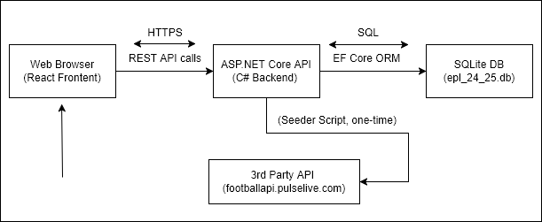

# High-Level Design Document

**TransferRoom.POC.EPL.Squads – Full Stack Tech Assignment**

---

## 1. Overview

This document describes the high-level design for a proof-of-concept (POC) web application that allows users to select any team in the 2024/25 English Premier League season and view detailed squad information. The solution demonstrates skills using React (frontend), C# ASP.NET Core (backend), SQLite (database), and Render.com (CI/CD deployment).

---

## 2. Requirements Mapping

| Requirement                                 | Solution Implementation                        |
| ------------------------------------------- | ---------------------------------------------- |
| Web-based app for EPL squad info            | React frontend + ASP.NET Core backend          |
| Query by team name or nickname              | Search supports both club names and nicknames  |
| Return profile picture, name, DOB, position | API and UI display all required player details |
| React frontend                              | Implemented with React + TypeScript            |
| C# middleware                               | Implemented with ASP.NET Core Web API          |
| CI/CD deployment                            | Automated deployment via Render.com            |
| 3rd party API integration                   | Data sourced from footballapi.pulselive.com    |
| Public GitHub repo with documentation       | All code and docs in public repo               |
| High-level design document                  | This document                                  |

---

## 3. Architecture Diagram

---

## 4. Component Descriptions

- **Frontend (React + TypeScript):**

  - User interface for searching and selecting EPL teams.
  - Displays squad details (profile picture, first name, surname, birthdate, position).
  - Supports search by team name or nickname.
  - Communicates with backend via REST API.

- **Backend (ASP.NET Core Web API):**

  - Exposes endpoints for teams and squads.
  - Serves data from a pre-seeded SQLite database.
  - Supports search by name or nickname.
  - Swagger UI for API documentation.

- **Database (SQLite):**

  - Stores EPL teams and squad data for the 2024/25 season.
  - Pre-seeded using a Node.js script.

- **Seeder Script (Node.js):**

  - Fetches latest EPL data from footballapi.pulselive.com.
  - Populates or updates the SQLite database.
  - Not required for normal usage (DB is included).

- **CI/CD (Render.com):**
  - Automated deployment of backend and frontend.
  - Public demo available.

---

## 5. Key Design Decisions

- **React & TypeScript:** Modern, widely-used frontend stack for rapid UI development.
- **ASP.NET Core (C#):** Robust, scalable backend framework with strong typing and tooling.
- **SQLite:** Lightweight, file-based DB suitable for POC and easy distribution.
- **Render.com:** Simple, free CI/CD and hosting for both frontend and backend.
- **3rd Party API:** Used unofficial footballapi.pulselive.com for up-to-date EPL data.
- **Nickname Search:** Nicknames sourced and mapped to teams for flexible search.

---

## 6. API Overview

- `GET /api/teams` — List all teams (supports `?search=`)
- `GET /api/teams/{id}` — Get team by ID
- `GET /api/teams/{id}/squad` — Get squad for a team

---

## 7. Deployment & CI/CD

- **CI/CD:**

  - GitHub repository connected to Render.com.
  - On push, code is built and deployed automatically.
  - Demo: [https://epl-squads-24-25-poc.onrender.com/](https://epl-squads-24-25-poc.onrender.com/)

- **Note:**
  - Free plan may cause backend to "sleep" when idle; first API call may be slow or time out.

---

## 8. Technical Challenges & Considerations

- **3rd Party API Limitations:**

  - Unofficial API may change or become unavailable.
  - Data mapping and normalization required for consistency.

- **Free Hosting Cold Starts:**

  - Render.com free plan puts backend to sleep, causing slow initial response.

- **Data Updates:**
  - Seeder script provided for potential data refreshes.

---

## 9. Future Improvements

- Add authentication and user accounts.
- Enhance error handling and loading states in UI.
- Support for additional leagues or seasons.
- Automated tests for backend and frontend.

---

## 10. Appendix

- **Source Code:** [GitHub Repository](https://github.com/s-shev/TransferRoom.POC.EPL.Squads)
- **Live Demo:** [https://epl-squads-24-25-poc.onrender.com/](https://epl-squads-24-25-poc.onrender.com/)

---

_End of Document_
